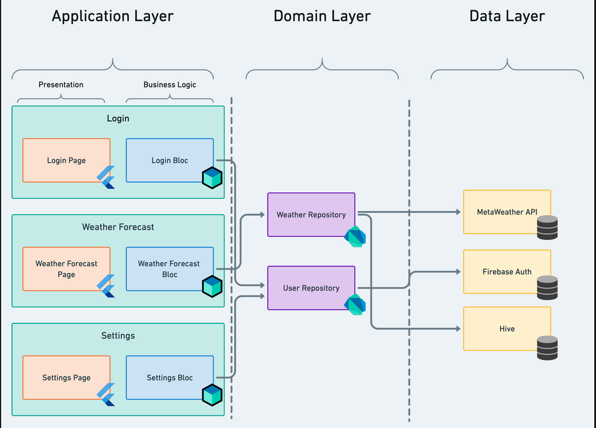

# product_inventory 

A flutter app that demonstrates clean architecture and that uses bloc library.

Topics covered:
* Bloc library for state management that also enforces to follow clean architecture
* Hydrated bloc for state management with persisted state
* Popular dio package for http service
* Offline mode with Floor library for database management

### App Architecture summary
- Used [Very Good Architecture](https://verygood.ventures/blog/very-good-flutter-architecture) for structuring the app.
- There are three layers in the app

    * Application/Feature layer (where user interacts, app UI and widget, where bloc resides and handles business logic)
    * Domain layer (where generate business value, aggregate data from data layer and provide data to business layer.
    * Data layer (where raw data is generated from various sources like remote and local sources.

### Graphical represenatation of Very Good Architechture (VGA)

    

Followed separation of concerns in terms of organizing the code.
Separation of concern brings below benefits:

    - Ease of refactoring
    - Ease of testing
    - Reusability of code

The first two layers reside in the main app. For the other two layers, two separate packages have been created for.

     
     1. Application/Feature layer
     2. Domain layer
     3. Data Layer (concret implementation for derive_api
     
                                                                                                                                                  
                                                                                                                                                  
### Installation

If you're new to Flutter the first thing you'll need is to follow the [setup instructions](https://flutter.dev/docs/get-started/install). 

Once Flutter is setup, you can use the latest `stable` channel:
 * Run `flutter channel stable`
 * Run `flutter upgrade`

Once you're on `master` branch, you're ready to run the app:
* `flutter run -d android`
* `flutter run -d ios`
* `flutter run -d web`   

